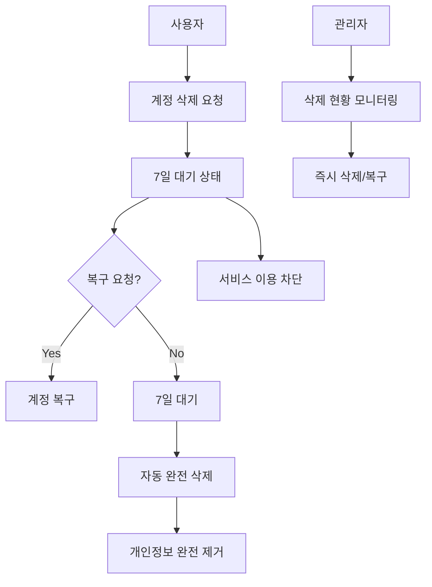

# 계정 삭제 기능 구현 가이드

> 🚨 **중요**: 개인정보보호법 및 GDPR 준수를 위한 7일 대기 시스템 구현

## 📋 개요

Glimpse의 계정 삭제 기능은 사용자의 안전과 개인정보보호를 위해 7일 대기 시스템을 구현합니다. 이는 실수로 인한 계정 삭제를 방지하고, 법적 요구사항을 준수하는 안전한 삭제 프로세스입니다.

## 🎯 핵심 특징

### ✅ 구현된 기능
- **7일 대기 시스템**: 삭제 요청 후 7일의 유예 기간 제공
- **계정 복구**: 대기 기간 내 계정 복구 가능
- **서비스 차단**: 삭제 대기 중 서비스 이용 불가
- **자동 스케줄링**: 7일 후 자동 완전 삭제
- **GDPR 준수**: 개인정보 완전 제거
- **관리자 대시보드**: 삭제 현황 모니터링
- **통계 및 분석**: 삭제 패턴 분석

### 🔒 보안 및 개인정보보호
- 개인정보 완전 익명화
- 결제 기록 법적 의무 보관 (익명화)
- 채팅 히스토리 보존 (익명화)
- 암호화된 데이터 안전 삭제

## 🏗️ 시스템 아키텍처



## 📁 파일 구조

### 서버 (NestJS)
```
server/src/user/
├── dto/
│   └── delete-account.dto.ts           # 삭제 요청 DTO
├── user-deletion.service.ts            # 삭제 비즈니스 로직
├── user-deletion.controller.ts         # 삭제 API 엔드포인트
├── account-deletion-scheduler.service.ts # 스케줄링 서비스
└── user-deletion.service.spec.ts       # 유닛 테스트

server/prisma/
└── migration-account-deletion.sql      # DB 마이그레이션
```

### 모바일 (React Native)
```
mobile/
├── screens/
│   ├── DeleteAccountScreen.tsx         # 삭제 요청 화면
│   └── AccountRestoreScreen.tsx        # 복구 화면
├── services/api/
│   └── accountDeletionService.ts       # 삭제 API 서비스
└── __tests__/
    └── accountDeletion.test.ts         # 테스트
```

### 관리자 대시보드 (Next.js)
```
admin/src/app/admin/
└── account-deletion/
    └── page.tsx                        # 삭제 관리 페이지
```

## 🔧 설치 및 설정

### 1. 데이터베이스 마이그레이션

```bash
# PostgreSQL 마이그레이션 실행
cd server
psql -U your_username -d your_database -f prisma/migration-account-deletion.sql

# Prisma 스키마 업데이트 (향후)
npx prisma db push
```

### 2. 환경변수 설정

```env
# .env 파일에 추가
NODE_ENV=production  # 스케줄러 활성화를 위해 필요
DELETION_GRACE_PERIOD_DAYS=7  # 대기 기간 (기본값)
```

### 3. 서비스 등록

```typescript
// user.module.ts에 서비스 추가
@Module({
  providers: [
    UserService,
    UserDeletionService,
    AccountDeletionSchedulerService,
  ],
  controllers: [
    UserController,
    UserDeletionController,
  ],
})
export class UserModule {}
```

## 🚀 API 사용법

### 계정 삭제 요청
```typescript
POST /api/v1/users/account
DELETE /api/v1/users/account
{
  "reason": "not_useful"
}

// 응답
{
  "success": true,
  "data": {
    "scheduledDeletionAt": "2024-01-08T05:00:00.000Z",
    "daysRemaining": 7
  },
  "message": "계정 삭제가 요청되었습니다. 7일 후 완전히 삭제됩니다."
}
```

### 계정 복구
```typescript
POST /api/v1/users/account/restore

// 응답
{
  "success": true,
  "message": "계정이 성공적으로 복구되었습니다."
}
```

### 삭제 상태 조회
```typescript
GET /api/v1/users/account/deletion-status

// 응답
{
  "success": true,
  "data": {
    "status": "DELETION_REQUESTED",
    "requestedAt": "2024-01-01T00:00:00.000Z",
    "scheduledDeletionAt": "2024-01-08T05:00:00.000Z",
    "daysRemaining": 5,
    "reason": "not_useful"
  }
}
```

## 📱 모바일 UI 사용법

### 삭제 화면 호출
```typescript
import { accountDeletionService } from '@/services/api/accountDeletionService';

const handleDeleteRequest = async (reason: string) => {
  const result = await accountDeletionService.requestDeletion({ reason });
  if (result.success) {
    // 성공 처리
    navigation.navigate('AccountRestoreScreen');
  }
};
```

### 복구 화면 호출
```typescript
import { AccountRestoreScreen } from '@/screens/AccountRestoreScreen';

// 복구 화면은 자동으로 삭제 상태를 확인하고 UI 표시
```

## ⏰ 스케줄링 시스템

### Cron 작업 스케줄
- **매일 오전 5시**: 삭제 예정 계정 완전 삭제
- **매일 오전 9시**: 삭제 1일 전 최종 알림
- **매일 자정**: 삭제 통계 업데이트

### 수동 실행 (관리자)
```typescript
// 즉시 삭제 처리 실행
const result = await schedulerService.runAccountDeletionNow();
console.log('처리 결과:', result);
```

## 🛡️ 보안 고려사항

### 데이터 익명화 정책
1. **개인 식별 정보**: 완전 삭제
2. **채팅 메시지**: "[삭제된 메시지]"로 대체
3. **결제 기록**: userId를 "DELETED_USER"로 익명화
4. **매치 기록**: 상대방 히스토리 보존을 위해 비활성화

### GDPR 준수 체크리스트
- [ ] 사용자 동의 확인
- [ ] 삭제 사유 기록
- [ ] 7일 대기 기간 제공
- [ ] 개인정보 완전 제거
- [ ] 법적 의무 데이터 익명화
- [ ] 삭제 완료 확인서 제공

## 🧪 테스트 가이드

### 유닛 테스트 실행
```bash
# 서버 테스트
cd server
npm run test -- user-deletion.service.spec.ts

# 모바일 테스트
cd mobile
npm run test -- accountDeletion.test.ts
```

### 통합 테스트 시나리오
1. **정상 삭제 플로우**: 요청 → 대기 → 완전삭제
2. **복구 플로우**: 요청 → 복구 → 정상 이용
3. **기간 만료**: 요청 → 7일 경과 → 복구 불가
4. **관리자 개입**: 즉시 삭제/복구

## 📊 모니터링 및 분석

### 관리자 대시보드 메트릭
- 삭제 대기 계정 수
- 일일/주간/월간 삭제 통계
- 삭제 사유 분석
- 복구율 통계
- 긴급 대응 필요 계정

### 알림 설정
- 긴급 삭제 계정 (1일 이내)
- 복구 기간 만료 알림
- 대량 삭제 패턴 감지

## 🚨 문제 해결

### 일반적인 이슈
1. **스케줄러가 작동하지 않음**
   - `NODE_ENV=production` 확인
   - Cron 서비스 등록 확인

2. **삭제가 완료되지 않음**
   - 트랜잭션 롤백 로그 확인
   - 외래키 제약 조건 확인

3. **복구가 실패함**
   - 7일 기간 확인
   - 계정 상태 확인

### 로그 확인
```bash
# 삭제 스케줄러 로그
grep "Account deletion process" server.log

# API 에러 로그
grep "account deletion" server.log | grep ERROR
```

## 📈 향후 개선 사항

### Phase 2 계획
- [ ] SMS/이메일 알림 시스템
- [ ] 다국어 지원 강화
- [ ] 삭제 사유별 맞춤 설문
- [ ] 복구 인센티브 시스템
- [ ] 고급 분석 대시보드

### 성능 최적화
- [ ] 배치 처리 최적화
- [ ] 캐시 전략 개선
- [ ] 데이터베이스 인덱싱
- [ ] 비동기 처리 확대

## 🤝 기여 가이드

### 코드 기여 시 주의사항
1. **개인정보보호 법규** 준수 확인
2. **테스트 케이스** 100% 커버리지
3. **로깅** 및 **모니터링** 고려
4. **국제화(i18n)** 메시지 추가
5. **접근성(A11y)** 준수

### 리뷰 체크리스트
- [ ] GDPR 준수 여부
- [ ] 보안 취약점 검사
- [ ] 성능 영향도 분석
- [ ] 테스트 커버리지
- [ ] 문서화 완성도

---

> 💡 **참고**: 이 기능은 개인정보보호법과 GDPR의 엄격한 요구사항을 준수하도록 설계되었습니다. 수정 시에는 반드시 법적 검토를 받으시기 바랍니다.

> 🔗 **관련 문서**: [GDPR 가이드](../guides/GDPR_COMPLIANCE.md) | [개인정보보호 정책](../guides/PRIVACY_POLICY.md)