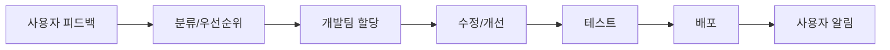
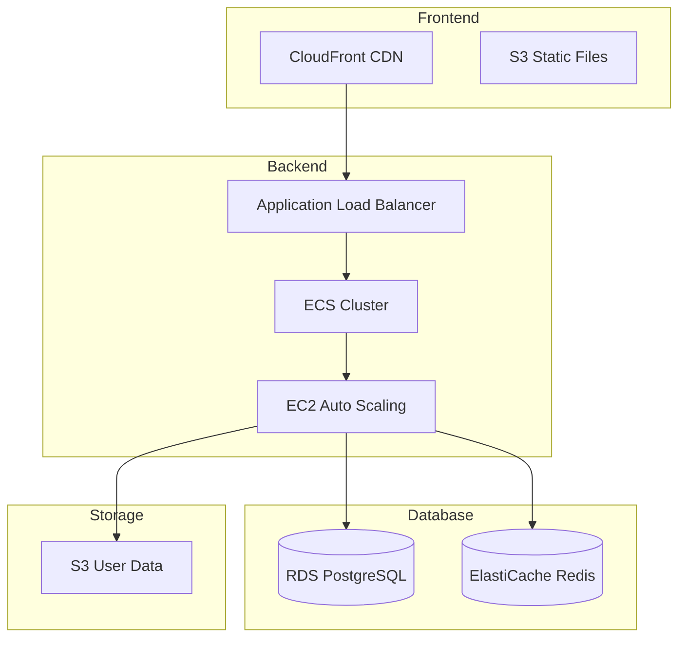
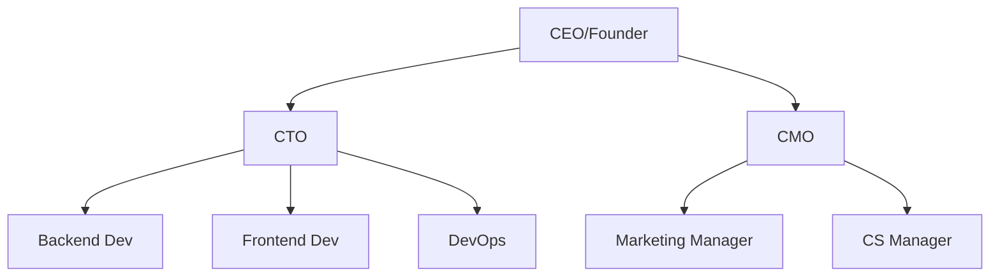

# 🚀 Glimpse 앱 출시 전략 및 로드맵

> 📅 작성일: 2025-01-28  
> 📌 버전: 1.0.0  
> 👤 작성자: Glimpse Product Team

## 📊 Executive Summary

Glimpse는 익명 매칭 기반의 한국형 데이팅 앱으로, 현재 개발 완성도 85%를 달성했습니다. 본 문서는 앱의 성공적인 출시와 지속 가능한 성장을 위한 종합적인 로드맵을 제시합니다.

### 핵심 목표
- **3개월**: Beta 출시 및 초기 사용자 10,000명 확보
- **6개월**: 정식 출시 및 MAU 50,000명 달성
- **12개월**: Series A 투자 유치 및 MAU 200,000명 달성

---

## 📈 현재 상태 분석

### ✅ 완료된 개발 현황

| 구분 | 기능 | 완성도 | 상태 |
|------|------|--------|------|
| **핵심 기능** | 익명 매칭 시스템 | 100% | ✅ 완료 |
| | 관심상대 찾기 (12가지 유형) | 100% | ✅ 완료 |
| | 실시간 채팅 | 95% | ✅ 완료 |
| | 그룹 시스템 (4가지 타입) | 100% | ✅ 완료 |
| **결제** | TossPay 연동 | 90% | 🔧 테스트 필요 |
| | KakaoPay 연동 | 90% | 🔧 테스트 필요 |
| | 구독 시스템 | 100% | ✅ 완료 |
| **관리** | Admin Dashboard | 85% | 🔧 기능 추가 필요 |
| | 랜딩 페이지 | 100% | ✅ 완료 |

### 🔧 기술 스택 현황

```yaml
Frontend:
  - React Native (Expo SDK 51)
  - TypeScript 5.x
  - Zustand (상태관리)
  - 완성도: 90%

Backend:
  - NestJS 10.x
  - Prisma ORM
  - PostgreSQL 15
  - Socket.IO
  - 완성도: 85%

Infrastructure:
  - AWS (준비 중)
  - Docker 컨테이너화
  - CI/CD (미구축)
  - 완성도: 30%
```

---

## 🎯 Phase 1: 출시 준비 (4-8주)

### 1.1 법적 준수사항 🔴 **[최우선]**

#### 필수 문서 준비
| 문서명 | 담당 | 기한 | 예산 |
|--------|------|------|------|
| 개인정보처리방침 | 법무법인 | 2주 | 200만원 |
| 이용약관 | 법무법인 | 2주 | 150만원 |
| 위치기반서비스 약관 | 법무법인 | 1주 | 100만원 |
| 청소년 보호정책 | 내부+법무 | 1주 | 50만원 |

#### 규제 준수 체크리스트
- [ ] 정보통신망법 준수 검토
- [ ] KISA 개인정보보호 가이드라인 적용
- [ ] 전자상거래법 준수 (인앱 결제)
- [ ] 통신판매업 신고
- [ ] 위치정보사업자 신고

### 1.2 보안 강화 🔴 **[긴급]**

#### 보안 감사 체크리스트
```javascript
// 구현 필요 항목
const securityTasks = {
  authentication: {
    "2FA 구현": "2주",
    "OAuth 2.0 강화": "1주",
    "세션 관리 개선": "3일",
    "비밀번호 정책 강화": "2일"
  },
  
  dataProtection: {
    "AES-256 암호화": "1주",
    "SSL/TLS 인증서": "1일",
    "데이터베이스 암호화": "1주",
    "백업 암호화": "3일"
  },
  
  apiSecurity: {
    "Rate Limiting": "3일",
    "SQL Injection 방지": "1주",
    "XSS 방지": "1주",
    "CSRF 토큰": "3일"
  }
};
```

### 1.3 성능 최적화 🟡 **[중요]**

#### 목표 성능 지표
| 지표 | 현재 | 목표 | 개선 방법 |
|------|------|------|-----------|
| API 응답 시간 | 500ms | <200ms | 캐싱, 쿼리 최적화 |
| 앱 시작 시간 | 5초 | <3초 | 번들 최적화, Lazy Loading |
| 이미지 로딩 | 3초 | <1초 | CDN, WebP 포맷 |
| 크래시율 | 2% | <0.5% | 에러 핸들링 강화 |

---

## 📱 Phase 2: 베타 테스트 (4주)

### 2.1 Closed Beta Test (Week 1-2)

#### 목표 및 전략
- **참가자**: 100명 (내부 직원 + 친구/가족)
- **플랫폼**: TestFlight (iOS), Google Play Console (Android)
- **피드백 채널**: Discord 서버 구축

#### 주요 테스트 시나리오
1. **온보딩 플로우** (10개 시나리오)
2. **매칭 시스템** (20개 시나리오)
3. **채팅 기능** (15개 시나리오)
4. **결제 프로세스** (10개 시나리오)
5. **그룹 기능** (15개 시나리오)

### 2.2 Open Beta Test (Week 3-4)

#### 확대 테스트 계획
```yaml
참가자 모집:
  - 목표: 1,000명
  - 채널:
    - 대학 커뮤니티 (에브리타임)
    - IT 커뮤니티 (OKKY, 커리어리)
    - SNS 광고 (Instagram, Facebook)
  
인센티브:
  - 베타 테스터 배지
  - 3개월 프리미엄 무료
  - 버그 리포트 보상 (1만원/건)
```

### 2.3 피드백 관리 시스템



---

## 🚀 Phase 3: 공식 출시 전략 (8주)

### 3.1 앱스토어 최적화 (ASO)

#### iOS App Store 전략
| 항목 | 내용 | 담당 | 기한 |
|------|------|------|------|
| 앱 이름 | "Glimpse - 설레는 익명 매칭" | 마케팅 | 1주 |
| 키워드 | 100개 선정 (소개팅, 매칭, 데이팅 등) | ASO 전문가 | 2주 |
| 스크린샷 | 6개 (한국어/영어) | 디자인팀 | 2주 |
| 앱 프리뷰 | 30초 동영상 | 영상팀 | 3주 |
| 설명문 | A/B 테스트 3개 버전 | 마케팅 | 1주 |

#### Google Play Store 전략
| 항목 | 내용 | 예산 |
|------|------|------|
| 제목 최적화 | 키워드 포함 30자 | - |
| 그래픽 에셋 | Feature Graphic, Icon | 100만원 |
| 스토어 등록 | 사전 등록 캠페인 | 200만원 |
| 리뷰 관리 | 초기 리뷰 100개 확보 | 50만원 |

### 3.2 마케팅 전략

#### 타겟 페르소나

```yaml
Primary (25-29세 직장인):
  - 특징: 바쁜 일상, 제한된 만남
  - 니즈: 효율적인 만남, 검증된 상대
  - 채널: Instagram, LinkedIn
  
Secondary (20-24세 대학생):
  - 특징: 활발한 소셜 활동
  - 니즈: 재미있는 만남, 새로운 경험
  - 채널: Instagram, TikTok
  
Tertiary (30-34세 전문직):
  - 특징: 높은 구매력, 시간 부족
  - 니즈: 진지한 만남, 프라이버시
  - 채널: Facebook, Naver
```

#### 마케팅 예산 분배 (총 5,000만원)

| 채널 | 예산 | 비중 | KPI |
|------|------|------|-----|
| Facebook/Instagram | 2,000만원 | 40% | CPI ₩3,000 |
| Google UAC | 1,500만원 | 30% | CPI ₩2,500 |
| 인플루언서 마케팅 | 1,000만원 | 20% | 리치 100만 |
| 네이버 검색광고 | 500만원 | 10% | CTR 5% |

### 3.3 파트너십 전략

#### 대학 제휴 프로그램
```yaml
목표 대학 (10개):
  - 서울대, 연세대, 고려대
  - 성균관대, 서강대, 한양대
  - 중앙대, 경희대, 외대, 시립대

제휴 내용:
  - 대학 인증 배지 제공
  - 학생 할인 (50% OFF)
  - 캠퍼스 이벤트 개최
  - 동아리 파트너십
```

#### B2B 기업 제휴
| 기업 유형 | 목표 | 제안 내용 |
|-----------|------|-----------|
| 대기업 | 5개사 | 직원 복지 프로그램 |
| 스타트업 | 20개사 | 네트워킹 이벤트 |
| 외국계 | 3개사 | Expat 커뮤니티 |

---

## 🔧 Phase 4: 인프라 구축

### 4.1 DevOps Pipeline

```yaml
CI/CD Architecture:
  Source Control:
    - GitHub (메인 레포)
    - Branch 전략: GitFlow
    
  Build Pipeline:
    - GitHub Actions
    - 자동 테스트 실행
    - Code Coverage > 80%
    - Security Scanning (Snyk)
    
  Deployment:
    - Staging → Production
    - Blue-Green Deployment
    - Rollback < 5분
    
  Monitoring:
    - Sentry (Error Tracking)
    - Datadog (APM)
    - CloudWatch (Infrastructure)
```

### 4.2 AWS 인프라 설계



### 4.3 예상 인프라 비용

| 서비스 | 스펙 | 월 비용 |
|--------|------|---------|
| EC2 (3대) | t3.large | 150만원 |
| RDS | db.t3.large Multi-AZ | 100만원 |
| ElastiCache | cache.t3.medium | 50만원 |
| S3 + CloudFront | 1TB Transfer | 50만원 |
| 기타 (Route53, VPC 등) | - | 50만원 |
| **총계** | | **400만원** |

---

## 💰 Phase 5: 수익화 전략

### 5.1 가격 정책

#### 프리미엄 구독
| 플랜 | 가격 | 혜택 |
|------|------|------|
| Monthly | ₩9,900 | 무제한 좋아요, 프로필 확인 |
| 3 Months | ₩24,900 | 월 ₩8,300 (16% 할인) |
| Annual | ₩99,000 | 월 ₩8,250 (17% 할인) |

#### 크레딧 시스템
| 패키지 | 가격 | 크레딧 | 개당 가격 |
|---------|------|---------|-----------|
| Starter | ₩2,500 | 5 | ₩500 |
| Popular | ₩9,900 | 25 | ₩396 |
| Best Value | ₩19,000 | 50 | ₩380 |

### 5.2 수익 예측 모델

```python
# 월별 수익 예측 (단위: 만원)
revenue_projection = {
    "Month 1": {
        "Users": 10000,
        "Conversion": 0.03,
        "ARPU": 15000,
        "Revenue": 450
    },
    "Month 3": {
        "Users": 30000,
        "Conversion": 0.05,
        "ARPU": 18000,
        "Revenue": 2700
    },
    "Month 6": {
        "Users": 50000,
        "Conversion": 0.08,
        "ARPU": 20000,
        "Revenue": 8000
    },
    "Month 12": {
        "Users": 200000,
        "Conversion": 0.10,
        "ARPU": 25000,
        "Revenue": 50000
    }
}
```

### 5.3 핵심 KPI 대시보드

| KPI | 정의 | 목표 (6개월) | 측정 주기 |
|-----|------|--------------|-----------|
| MAU | Monthly Active Users | 50,000 | Daily |
| DAU/MAU | Stickiness Ratio | 40% | Daily |
| Conversion Rate | Free → Paid | 8% | Weekly |
| ARPU | Average Revenue Per User | ₩20,000 | Monthly |
| CAC | Customer Acquisition Cost | ₩3,000 | Weekly |
| LTV | Lifetime Value | ₩60,000 | Monthly |
| Churn Rate | 월 이탈률 | <10% | Monthly |
| Match Rate | 매칭 성공률 | >30% | Daily |

---

## 👥 Phase 6: 조직 구성

### 6.1 현재 조직도



### 6.2 채용 로드맵

#### 즉시 채용 (1개월 내)
| 포지션 | 경력 | 연봉 | 주요 업무 |
|--------|------|------|-----------|
| Senior Backend Dev | 5년+ | 7,000만원 | API 설계, 성능 최적화 |
| Marketing Manager | 3년+ | 5,000만원 | 캠페인 기획/실행 |
| CS Specialist | 1년+ | 3,500만원 | 고객 응대, 이슈 처리 |

#### 3개월 내 채용
| 포지션 | 인원 | 예산 |
|--------|------|------|
| iOS Developer | 1명 | 5,500만원 |
| Android Developer | 1명 | 5,500만원 |
| Data Analyst | 1명 | 5,000만원 |
| UI/UX Designer | 1명 | 4,500만원 |
| QA Engineer | 1명 | 4,000만원 |

### 6.3 팀 운영 프로세스

```yaml
Daily Operations:
  09:00: Daily Standup (15분)
  10:00: CS Ticket Review
  14:00: Monitoring Report
  17:00: KPI Dashboard Check
  18:00: End of Day Sync

Weekly Rituals:
  Monday:
    - Sprint Planning (2시간)
    - KPI Review (1시간)
  
  Wednesday:
    - Marketing Review (1시간)
    - Product Backlog Grooming (1시간)
  
  Friday:
    - Demo Day (1시간)
    - Retrospective (1시간)
    - Team Building (2시간)

Monthly Events:
  - All Hands Meeting
  - User Research Review
  - Competitive Analysis
  - Financial Review
```

---

## 📈 Phase 7: 성장 전략

### 7.1 제품 로드맵

#### Q1 2025 (Launch Quarter)
- [ ] 베타 테스트 완료
- [ ] 정식 출시
- [ ] 기본 기능 안정화
- [ ] CS 시스템 구축

#### Q2 2025 (Growth)
- [ ] AI 매칭 알고리즘 v1.0
- [ ] 영상 프로필 기능
- [ ] 음성 통화 기능
- [ ] 프리미엄 이벤트 기능

#### Q3 2025 (Expansion)
- [ ] 그룹 미팅 기능
- [ ] 가상 데이트 공간
- [ ] B2B 서비스 런칭
- [ ] 일본 시장 진출 준비

#### Q4 2025 (Scale)
- [ ] AI 매칭 v2.0
- [ ] 글로벌 확장 (일본)
- [ ] Series A 준비
- [ ] MAU 200K 달성

### 7.2 투자 유치 계획

#### Seed Round (6개월)
```yaml
목표 금액: 10억원
Valuation: 40억원 (Pre-money)

Use of Funds:
  - 개발 인력: 40% (4억)
  - 마케팅: 30% (3억)
  - 인프라: 20% (2억)
  - 운영비: 10% (1억)

Target Investors:
  - 매쉬업엔젤스
  - 프라이머
  - 스프링캠프
  - 퓨처플레이
```

#### Series A (12개월)
```yaml
목표 금액: 50억원
Valuation: 200억원 (Pre-money)

Prerequisites:
  - MAU 200,000+
  - Monthly Revenue ₩5억+
  - Unit Economics 검증

Target Investors:
  - 알토스벤처스
  - 스톤브릿지캐피탈
  - IMM 인베스트먼트
  - 소프트뱅크벤처스
```

---

## ⚠️ 리스크 관리

### 리스크 매트릭스

| 리스크 유형 | 발생 가능성 | 영향도 | 대응 방안 |
|------------|------------|--------|-----------|
| **기술적 리스크** | | | |
| 서버 다운타임 | 중 | 상 | Multi-region 백업, Auto-scaling |
| 데이터 유출 | 하 | 치명적 | 보안 감사, 암호화, 접근 제어 |
| 스케일링 실패 | 중 | 상 | Load Testing, CDN, 캐싱 |
| **사업적 리스크** | | | |
| 경쟁사 출현 | 상 | 중 | 차별화 강화, 빠른 혁신 |
| 규제 변경 | 중 | 상 | 법무 자문, 컴플라이언스 |
| 자금 부족 | 중 | 치명적 | 6개월 런웨이 확보 |
| **운영적 리스크** | | | |
| 핵심 인력 이탈 | 중 | 상 | 스톡옵션, 복지, 문화 |
| CS 이슈 폭증 | 상 | 중 | 자동화, FAQ, 챗봇 |
| 품질 이슈 | 중 | 상 | QA 프로세스, 자동 테스트 |

### 위기 대응 프로토콜

```yaml
Level 1 (Minor):
  - 담당자 즉시 대응
  - 30분 내 해결
  - Slack 알림
  
Level 2 (Major):
  - 팀 리더 에스컬레이션
  - 1시간 내 해결
  - 고객 공지 검토
  
Level 3 (Critical):
  - CEO 즉시 보고
  - War Room 소집
  - 실시간 상황 업데이트
  - PR 대응 준비
```

---

## 📋 실행 체크리스트

### 🔴 Week 1-2: 긴급 작업
- [ ] 법적 문서 작성 착수
- [ ] 보안 감사 일정 확정
- [ ] 핵심 버그 수정
- [ ] 베타 테스터 모집 시작

### 🟡 Week 3-4: 준비 작업
- [ ] TestFlight 설정 완료
- [ ] 마케팅 에이전시 선정
- [ ] CS 시스템 구축
- [ ] 모니터링 도구 설치

### 🟢 Week 5-6: 마케팅 준비
- [ ] ASO 최적화 완료
- [ ] SNS 계정 개설
- [ ] 콘텐츠 제작 (10개)
- [ ] 인플루언서 컨택

### ⚪ Week 7-8: 최종 점검
- [ ] 부하 테스트 실시
- [ ] 앱스토어 심사 제출
- [ ] 런칭 이벤트 준비
- [ ] 언론 보도자료 배포

---

## 📊 성공 지표

### 출시 후 3개월 목표
```yaml
Acquisition:
  - Downloads: 50,000
  - Signup Rate: 60%
  - MAU: 10,000

Activation:
  - Profile Completion: 70%
  - First Match: 40%
  - First Message: 30%

Retention:
  - D1: 60%
  - D7: 40%
  - D30: 25%

Revenue:
  - Paid Users: 500
  - Conversion: 5%
  - Monthly Revenue: ₩7,500,000

Referral:
  - Viral Coefficient: 0.3
  - NPS Score: 40+
```

---

## 📞 연락처

| 역할 | 담당자 | 연락처 |
|------|--------|--------|
| CEO | - | ceo@glimpse.app |
| CTO | - | cto@glimpse.app |
| Product Manager | - | pm@glimpse.app |
| Marketing | - | marketing@glimpse.app |
| CS | - | support@glimpse.app |

---

## 📝 문서 버전 관리

| 버전 | 날짜 | 변경 내용 | 작성자 |
|------|------|-----------|--------|
| 1.0.0 | 2025-01-28 | 초안 작성 | Product Team |
| - | - | - | - |

---

> 💡 **Note**: 이 문서는 정기적으로 업데이트되며, 모든 팀원은 최신 버전을 확인해야 합니다.

> ⚠️ **Confidential**: 이 문서는 기밀 정보를 포함하고 있으며, 외부 공유는 금지됩니다.

---

*Copyright © 2025 Glimpse. All rights reserved.*